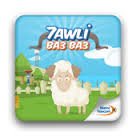

# HawliBaBa

<b>Hawli Ba3 Ba3</b> is Kind of Pet game where you have to take care of your pet (sheep ) , perform operations and actions , feed your pet
to pass 3 periods of his life cycle , get weight ,in the end of the period if you are in the top 10 leader-board you win that sheep .

That was an advergame for  Moroccan Telecom , Telecom operator Number 1 in morocco .

<b>Technologies</b> :

I have used
- <b>Robotlegs</b> as MVC framework , which gives a very clear structure and readability to my code .
- <b>Blitting</b> to gain better performance , by create SpriteSheets for all my characters .
- <b>AMFPHP</b> , to ensure a fast , secure , and structured communication with the server side